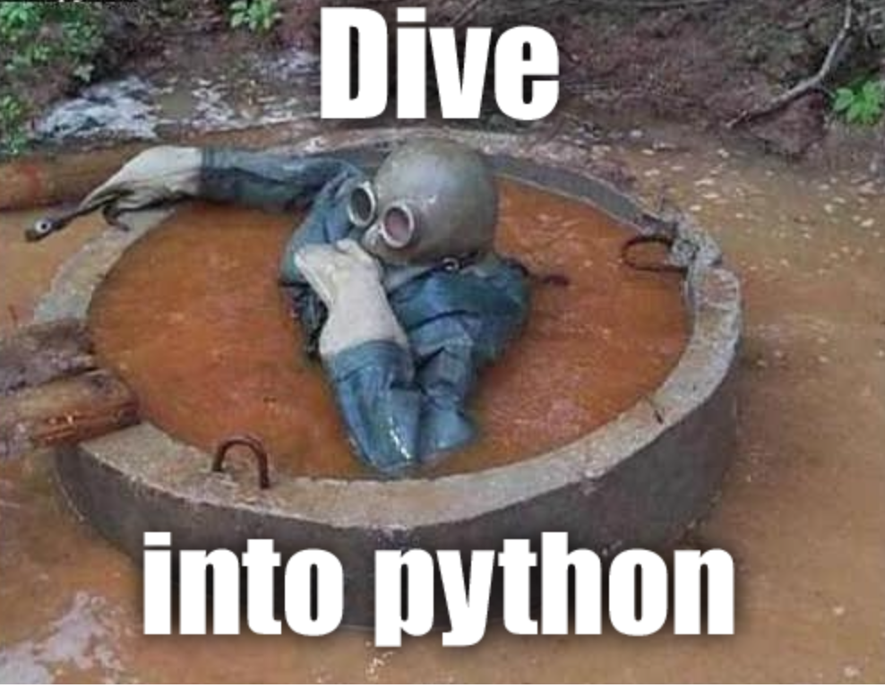

# Computer Science using Python
- [Big O Notation](essentials#big-o-notation)
- [Algorithms](essentials#algorithms)
    - [Sorting](essentials#sorting)
    - [Dynamic Programming](essentials#dynamic-programming)
    - [Divide And Conquer](essentials#divide-and-conquer)
- [Data Structures](essentials#data-structures)
    - [Graph](essentials#graph)
    - [Tree](essentials#tree)
    - [Hash Table](essentials#hash-table)
    - [List](essentials/readme.md#list)
- [Python built-in features](builtin#built-in-features)

