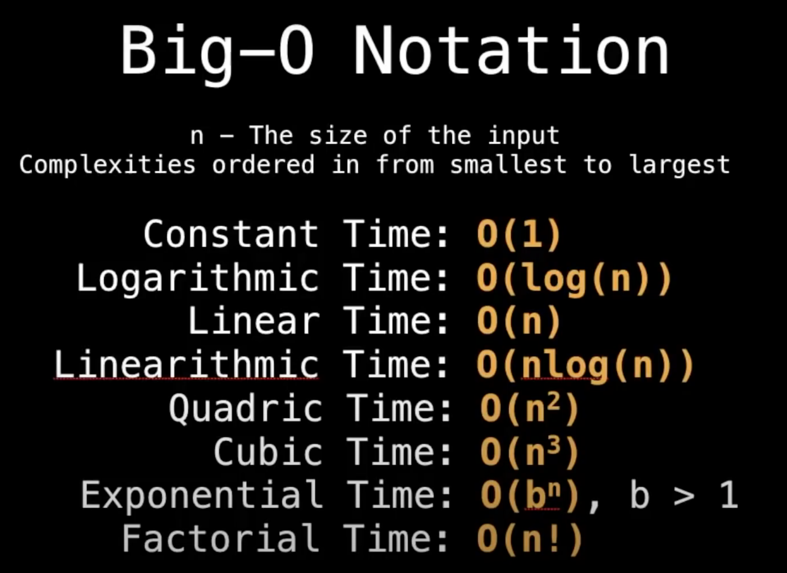

```
N    | O(1)| O(log(n))| O(n) | O(n*log(n)) | O(n**n) |
1    | 1   | 1        | 1    | 1           | 1       |
4    | 1   | 2        | 4    | 8           | 16      |
16   | 1   | 4        | 16   | 64          | 256     |
1024 | 1   | 10       | 1024 | 10240       | 1048576 |

Compare O(n**n) to O(n*log(n)):
n**n / (n lg n) = n / lg n = 1,000,000 / lg(1,000,000)
Since  2**20 is approximately 1 million, we obtain approximately 50,000.
```

